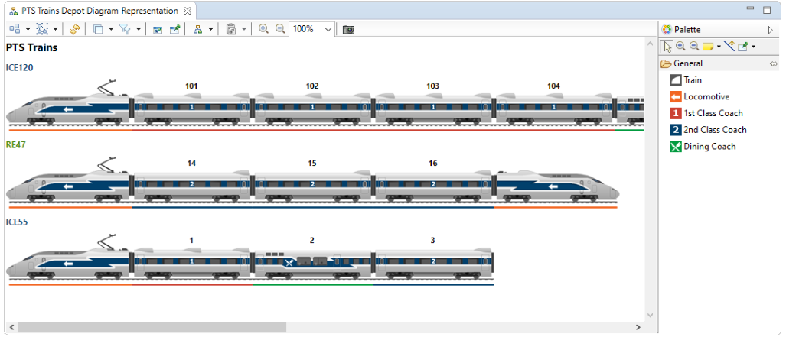

# MoSyL: Public Transport System

This is the Public Transport System project for the Modelling Systems and
Languages course at the MSc Master in Computer Science at the IT University
of Copenhagen.

## Authors
- Rebecca Melanie Heegaard Nielsen
- Francisco Martínez Lasaca
- Jonas Christiansen Røygaard
- Emil Nielsen Lemming

## License
[MIT](https://choosealicense.com/licenses/mit/)
